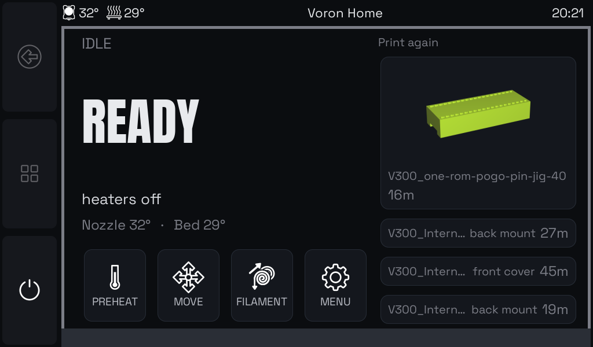
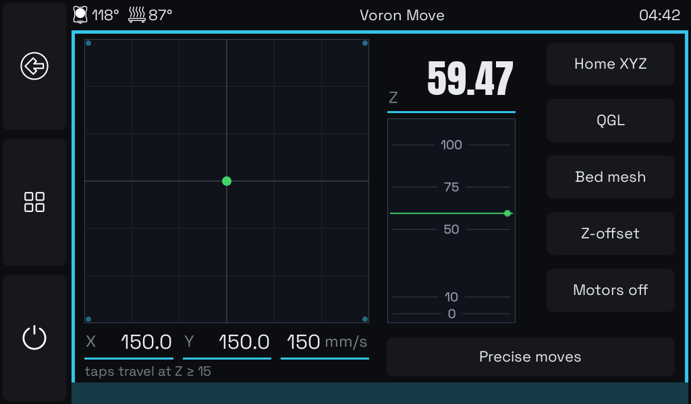
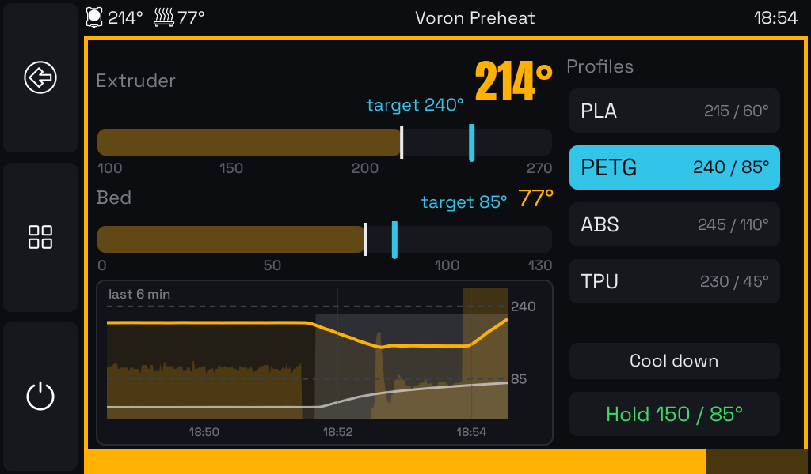
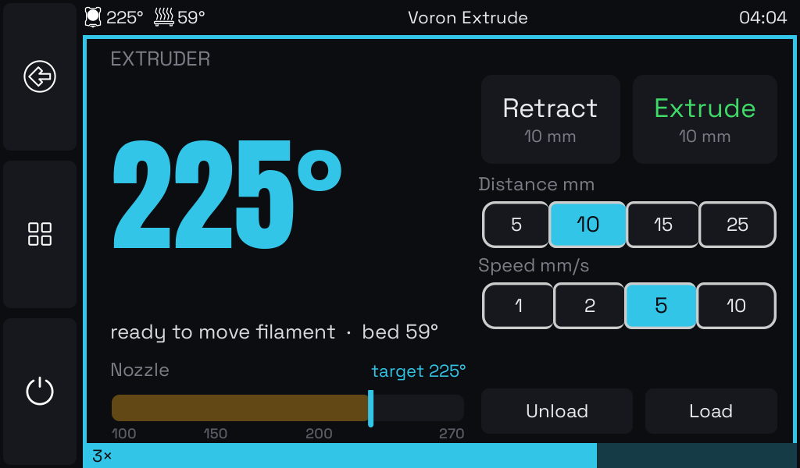
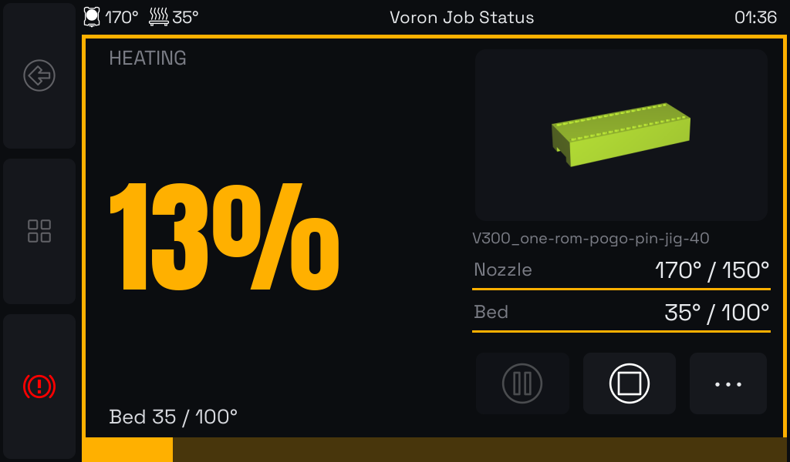
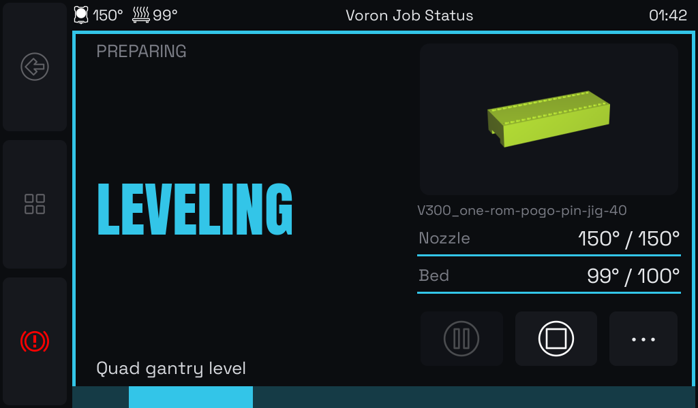
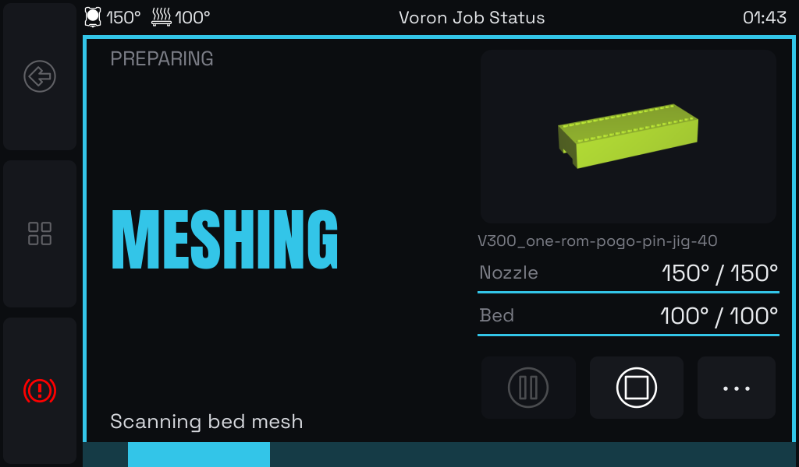
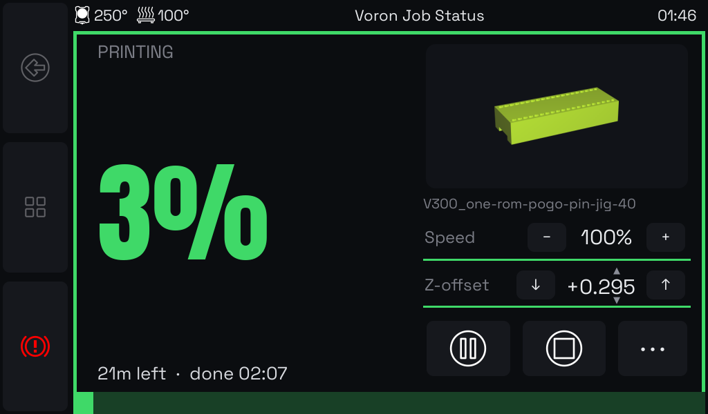
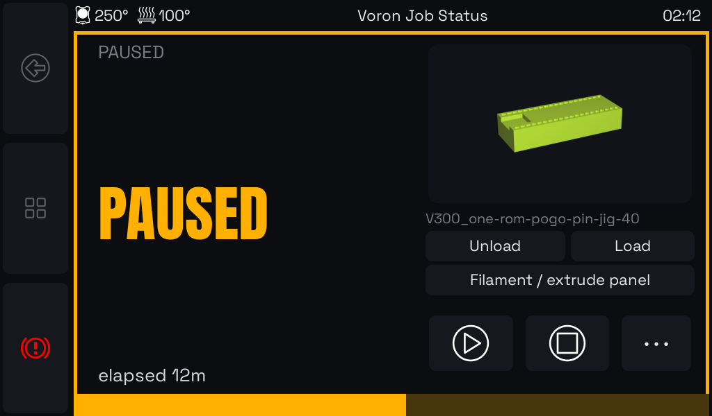
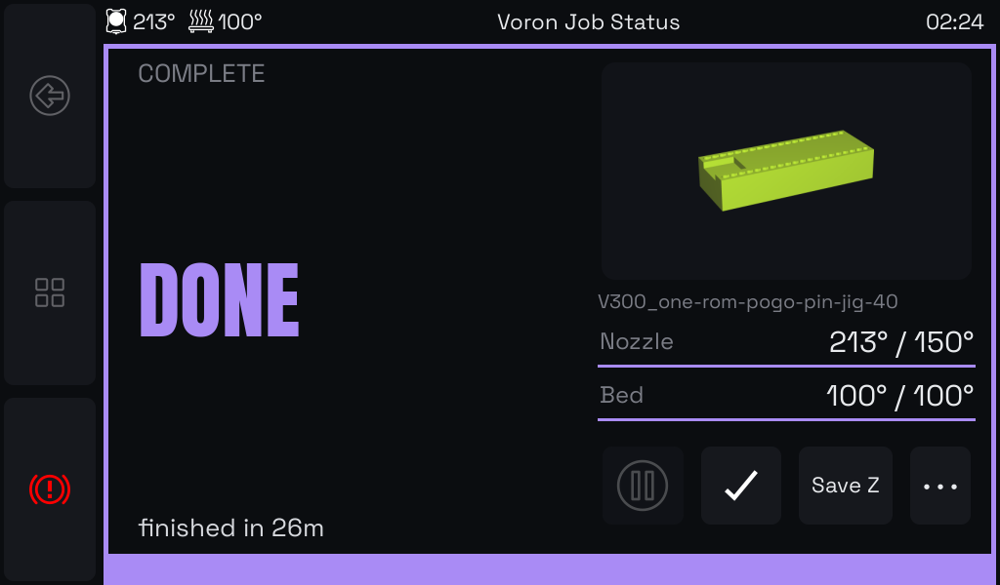

# Glance — at-a-glance KlipperScreen UI

## Why

KlipperScreen is excellent as a complete touch control panel for Klipper.
It gives you access to everything, and its panel framework makes projects
like this possible with just a few drop-in files.

But during active operation state and progress is hard to judge from across
the room, and the grid-based UI is at times clunky to operate. This project
tries to address this by replacing a few key screens, while most everything 
else stays available through the standard KlipperScreen panels.

Each screen shows one large figure with a phase color — amber for
heating, cyan for leveling, green for printing, violet for done, red for
error. The progress rail and minimal layout make the printer's state
readable from meters away, without walking up to the screen.

Glance is built on KlipperScreen, not against it: five drop-in panels,
one theme, and a small patch. KlipperScreen handles the long tail of
printer controls; Glance is for everything you want to know at a glance.

## Screens

| | |
|---|---|
|  |  |
| **Home** — READY/WARM/HEATING hero, icon verb cards, scrollable print-again history | **Move** — tap-to-go bed map, Z height map, one-tap verbs |
|  |  |
| **Preheat** — draggable heater sliders, Mainsail-style power graph, material profiles | **Extrude** — queueable strokes with rail count badge, cold-gated verbs |

A print walks the job screen through its phases:

| | |
|---|---|
|  |  |
| **Heating** — amber, ambient-referenced percent from the M117 heat bars | **Leveling** — cyan, QGL driven by the heat-soak gate |
|  |  |
| **Meshing** — fresh bed mesh when the soak gate demands one | **Printing** — green percent, time left + ETA, Speed and Z-offset steppers |
|  |  |
| **Paused** — filament controls swap in; resume/stop verbs | **Done** — violet phase, temps cooling, Save Z |

## How to install

Glance is an add-on, not a standalone app: it requires a working
KlipperScreen (v0.4.x) already installed and showing on your printer's
display. SSH onto the device running KlipperScreen, then:

```
cd ~ && git clone https://github.com/mathiasm74/klipperscreen-glance.git
cd klipperscreen-glance && ./install.sh
```

The installer copies the panels, theme, and fonts, applies the small
KlipperScreen patch (and tells you if your KlipperScreen version has
drifted), and places `glance.cfg` next to your printer config. Two
manual edits finish the job:

**1. printer.cfg** — include the Glance macros:

```
[include glance.cfg]
```

That brings in `_HEAT_WAIT` (heating that narrates its progress),
filament load/unload helpers, and heat-soak bookkeeping. Then let your
`PRINT_START` tell the screen what it's doing: heat with `_HEAT_WAIT`
instead of `M190`/`M109`, and label the setup steps with `M117`:

```
_HEAT_WAIT HEATER=heater_bed TARGET={BED_TEMP}
_HEAT_WAIT HEATER=extruder TARGET={EXTRUDER_TEMP}
M117 Leveling gantry
QUAD_GANTRY_LEVEL          ; or your G32 macro
M117 Scanning bed mesh
BED_MESH_CALIBRATE
M117                       ; clear -> the green PRINTING phase
```

(There's a complete `PRINT_START` example at the bottom of `glance.cfg`.)
The standard `M190`/`M109` commands block the printer from updating any
display while they wait — `_HEAT_WAIT` is what makes the amber heating
percent possible at all.

**2. KlipperScreen.conf** — select the theme, and optionally define the
material profiles the Preheat screen offers:

```
[main]
theme: glance
auto_open_extrude: False

[preheat PLA]
extruder: 215
bed: 60
```

For updates through Moonraker's Update Manager:

```
[update_manager glance]
type: git_repo
path: ~/klipperscreen-glance
origin: https://github.com/mathiasm74/klipperscreen-glance.git
managed_services: KlipperScreen
install_script: install.sh
```

## Will it work on my printer?

Glance adapts to what your printer actually has. Buttons for features
your machine doesn't support simply don't appear: no filament
load/unload macros, no filament buttons; no quad gantry leveling, no QGL
button; no probe, no Save Z. There's nothing to configure — the screens
look at your printer's setup and show what applies.

One thing is worth adopting for the full experience: `glance.cfg` (the
installer puts it next to your printer config, ready to include). It
teaches your print-start routine to narrate what it's doing, which is
what gives the job screen its live heating percent and the leveling and
meshing phases. Without it everything still works and prints still track
progress — you just miss the play-by-play during warm-up, because
standard heat-and-wait commands block the printer from updating any
screen until they finish.

## Other screen sizes

The layout is designed at 1024×600. Panels route their absolute pixel
sizes through a shared scale (`min(w/1024, h/600)`) at runtime, and
`install.sh --width 800 --height 480` generates a proportionally scaled
stylesheet for e.g. a 5" HDMI display. That's mechanical scaling of one
source design — no forked copies — so expect it to be usable but worth a
fine-tuning pass on real hardware.
